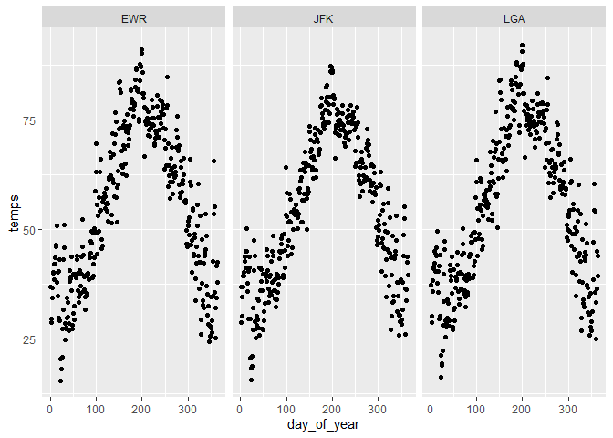

Practice Exam
================
Anantha Rao
2/29/2020

# Practice Exam

This practice exam asks you to do several code wrangling tasks that we
have done in class so far.

Clone this repo into Rstudio and fill in the necessary code. Then,
commit and push to github. Finally, turn in a link to canvas.

    ## -- Attaching packages -------------------- tidyverse 1.3.0 --

    ## <U+2713> ggplot2 3.2.1     <U+2713> purrr   0.3.3
    ## <U+2713> tibble  2.1.3     <U+2713> dplyr   0.8.3
    ## <U+2713> tidyr   1.0.2     <U+2713> stringr 1.4.0
    ## <U+2713> readr   1.3.1     <U+2713> forcats 0.4.0

    ## -- Conflicts ----------------------- tidyverse_conflicts() --
    ## x dplyr::filter() masks stats::filter()
    ## x dplyr::lag()    masks stats::lag()

Make a plot with three facets, one for each airport in the weather data.
The x-axis should be the day of the year (1:365) and the y-axis should
be the mean temperature recorded on that day, at that airport.

``` r
library(lubridate)
```

    ## 
    ## Attaching package: 'lubridate'

    ## The following object is masked from 'package:base':
    ## 
    ##     date

``` r
weather %>% mutate(day_of_year = yday(time_hour)) %>% group_by(origin,day_of_year) %>% summarize(temps = mean(temp)) %>% 
  ggplot(mapping = aes(x = day_of_year,
                       y = temps)) +
  facet_wrap(~origin) + geom_point()
```

    ## Warning: Removed 1 rows containing missing values (geom_point).

<!-- -->

Make a non-tidy matrix of that data where each row is an airport and
each column is a day of the year.

``` r
library(lubridate)
weather %>% mutate(day_of_year = yday(time_hour)) %>% group_by(origin,day_of_year) %>% summarize(temps = mean(temp)) %>% pivot_wider(names_from = day_of_year,values_from = temps) %>% View
```

For each (airport, day) contruct a tidy data set of the airport’s
“performance” as the proportion of flights that departed less than an
hour late.

``` r
flights %>% group_by(origin,year,month,day) %>% summarize(onTimePer = mean(dep_delay < 60,na.rm = T)) -> flightPerformance
```

Construct a tidy data set to that give weather summaries for each
(airport, day). Use the total precipitation, minimum visibility, maximum
wind\_gust, and average wind\_speed.

``` r
weather %>% group_by(origin,year,month,day) %>% summarize(totalPrecip = sum(precip),
                                                          minVisibility = min(visib),
                                                          maxWindGust = max(wind_gust,na.rm = T),
                                                          meanWindSpeed = mean(wind_speed,na.rm = T)) -> weatherSummaries

View(weatherSummaries)
```

Construct a linear model to predict the performance of each
(airport,day) using the weather summaries and a “fixed effect” for each
airport. Display the summaries.

``` r
flightWeather <- flightPerformance %>% left_join(weatherSummaries, by = c('origin','year','month','day'))

model <- lm(onTimePer~origin+totalPrecip+minVisibility+meanWindSpeed,data = flightWeather)
summary(model)
```

    ## 
    ## Call:
    ## lm(formula = onTimePer ~ origin + totalPrecip + minVisibility + 
    ##     meanWindSpeed, data = flightWeather)
    ## 
    ## Residuals:
    ##      Min       1Q   Median       3Q      Max 
    ## -0.45572 -0.01734  0.01755  0.03704  0.18800 
    ## 
    ## Coefficients:
    ##                 Estimate Std. Error t value Pr(>|t|)    
    ## (Intercept)    0.8605210  0.0082091 104.825  < 2e-16 ***
    ## originJFK      0.0200180  0.0052986   3.778 0.000167 ***
    ## originLGA      0.0209328  0.0052113   4.017 6.31e-05 ***
    ## totalPrecip   -0.0531217  0.0077869  -6.822 1.49e-11 ***
    ## minVisibility  0.0081510  0.0006977  11.682  < 2e-16 ***
    ## meanWindSpeed -0.0010823  0.0005174  -2.092 0.036684 *  
    ## ---
    ## Signif. codes:  0 '***' 0.001 '**' 0.01 '*' 0.05 '.' 0.1 ' ' 1
    ## 
    ## Residual standard error: 0.0698 on 1086 degrees of freedom
    ##   (3 observations deleted due to missingness)
    ## Multiple R-squared:  0.2532, Adjusted R-squared:  0.2498 
    ## F-statistic: 73.65 on 5 and 1086 DF,  p-value: < 2.2e-16

Repeat the above, but only for EWR. Obviously, exclude the fixed effect
for each airport.

``` r
flightWeather %>% filter(origin == 'EWR') -> flightWeather2

model2 <- lm(onTimePer~totalPrecip+minVisibility+meanWindSpeed,data = flightWeather2)
summary(model2)
```

    ## 
    ## Call:
    ## lm(formula = onTimePer ~ totalPrecip + minVisibility + meanWindSpeed, 
    ##     data = flightWeather2)
    ## 
    ## Residuals:
    ##      Min       1Q   Median       3Q      Max 
    ## -0.32733 -0.03119  0.02363  0.04566  0.18642 
    ## 
    ## Coefficients:
    ##                 Estimate Std. Error t value Pr(>|t|)    
    ## (Intercept)    0.8658870  0.0134506  64.375  < 2e-16 ***
    ## totalPrecip   -0.0512542  0.0133869  -3.829 0.000152 ***
    ## minVisibility  0.0086600  0.0013316   6.504 2.62e-10 ***
    ## meanWindSpeed -0.0020805  0.0008928  -2.330 0.020341 *  
    ## ---
    ## Signif. codes:  0 '***' 0.001 '**' 0.01 '*' 0.05 '.' 0.1 ' ' 1
    ## 
    ## Residual standard error: 0.07406 on 360 degrees of freedom
    ##   (1 observation deleted due to missingness)
    ## Multiple R-squared:  0.2366, Adjusted R-squared:  0.2302 
    ## F-statistic: 37.19 on 3 and 360 DF,  p-value: < 2.2e-16
